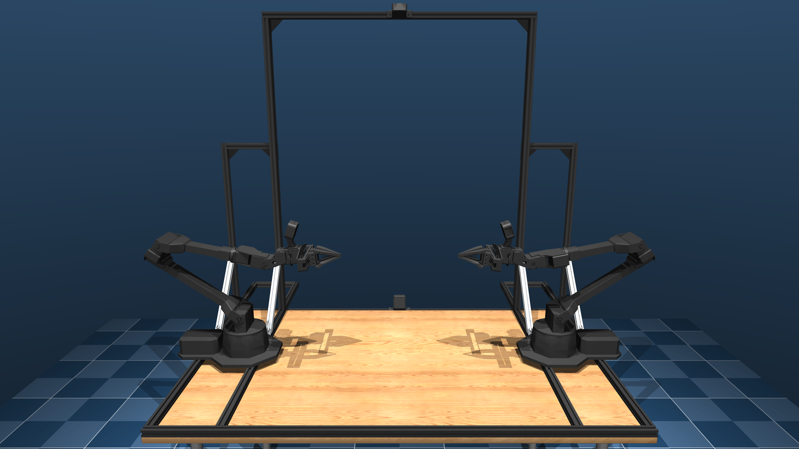

# Aloha SIM

This repository contains MJCF file of [ALOHA](https://github.com/tonyzhaozh/aloha) and robot learning env based on [gymnasium](https://gymnasium.farama.org/index.html)

## What's new?

1. we use ALOHA Model provided by [mujoco_menagerie](https://github.com/google-deepmind/mujoco_menagerie/tree/main/aloha), which has higher model quality
and wrist cameras.
2. we create sim env based on modern robot learning suite [gymnasium](https://gymnasium.farama.org/index.html)
3. We provide some available out of box scripts, helping you easily compelte whole task collecting and evaluation process

## Task

The following tasks are available out of the box:

- empty scene: Only ALOHA robot included
- transfer_cube: Including 5 removable cubes on the tablet

## Scripts

We provide some available out of box scripts, helping you easily compelte whole task collecting and evaluation process, run `python -m scripts.<script_name>` in the project root:

- check_render.py: check whether MUJOCO detects your render device
- record_sim_episodes.py: teleoperate aloha master arm to compelte task in sim env, the episode of the task will be saved as `.hdf5` file automatically
- replay_episodes.py: replay the episode saved in sim env
- sim_teleop.py: test the connection between your real master arm and sim env
- visualize_episodes.py: export `.mp4` video from saved `.hdf5` file

## DIY

If you want to add your custom task, add task file in `aloha_gym/task/<task>.py`. Create new task class, inheriting from `AlohaTask` in `base.py`, implementing abstract method.

To load MJCF file of task scene, put the MJCF into dir `aloha_xml`, then overwriting `def get_xml_file(self)` method in your task class.

## Acknowlege

Thanks to the MJCF file of ALOHA provided by [mujoco_menagerie](https://github.com/google-deepmind/mujoco_menagerie/tree/main/aloha)